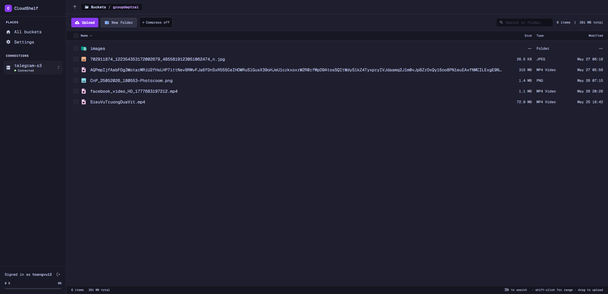

# CloudShelf



A self-hosted file browser for S3-compatible storage. One user, one
password, your buckets. Works with MinIO, R2, AWS, Backblaze, Wasabi,
[telegram-s3](https://github.com/hoangvu12/telegram-s3) — anything that
speaks the S3 API.

> Heads up: single-user only. One env-var login, signed-cookie session,
> S3 credentials sitting as plaintext in SQLite. Fine behind HTTPS, but
> if you put it on the public internet I'd still want Cloudflare Access
> or Authelia in front of it.

## What it does

- Multiple S3 endpoints in one app. Switch between them from the header.
- File-manager browsing: virtual folders, breadcrumbs, grid or list
  view, search, sort.
- Drag-and-drop uploads — single files or entire folders. Drag a tree onto
  the browser (or hit "Upload folder") and the subdirectories are recreated
  under your current prefix. Bytes go browser → S3 directly via presigned
  URLs, so the server never touches the payload; progress bars are
  honest and your bandwidth isn't doubled. Multipart for big files.
- Inline previews for images, video, audio, PDFs, and code. Syntax
  highlighting runs in a web worker with virtualized line rendering,
  so a 3MB JSON doesn't freeze the tab.
- Presigned share links with a TTL — Alt-click "Copy link" (or use Share…)
  for a dialog with chips (15m / 1h / 1d / 7d or custom), live countdown,
  and a QR code.
- Light, dark, or system theme. Keyboard shortcuts everywhere they make
  sense.

## Stack

Frontend is Vite 6, React 19, TypeScript (strict), TanStack Router +
Query, Tailwind v4, shadcn/ui, Zustand, Shiki.

Backend is Bun + Hono on `:3001`. `bun:sqlite` holds the connection
store. `@aws-sdk/client-s3` runs server-only and only mints presigns
plus a few control-plane calls.

In production, one process does both: `bun run start` serves `/api/*`
and the built SPA on the same port.

## Quick start (local)

```bash
bun install
cp .env.example .env       # then edit CLOUDSHELF_USERNAME / PASSWORD
bun run dev                # API on :3001, Vite on :5173
```

Open <http://localhost:5173>, sign in with the credentials from `.env`,
hit **Add connection**, and point it at any S3-compatible endpoint.
CloudShelf probes the credentials before saving so you find out about
typos immediately.

### Other scripts

```bash
bun run dev:server   # bun --watch server/index.ts        (:3001 only)
bun run dev:ui       # vite                                (:5173, proxies /api)
bun run typecheck    # tsc -b
bun run build        # tsc -b && vite build → dist/
bun run start        # NODE_ENV=production bun server/index.ts
                     #   → serves SPA from ./dist + /api on $PORT
```

### Environment variables

| Var | Default | What it does |
|---|---|---|
| `CLOUDSHELF_USERNAME` | — | Required. Login username. |
| `CLOUDSHELF_PASSWORD` | — | Required. Login password, timing-safe compare. |
| `PORT` | `3001` | Server port (API + SPA in prod) |
| `CLOUDSHELF_DB` | `./data/cloudshelf.db` | SQLite file location; mount a volume here in prod |
| `CLOUDSHELF_API` | `http://localhost:3001` | Vite dev proxy target |
| `NODE_ENV` | — | Set to `production` to enable static SPA serving |

The server won't start without `CLOUDSHELF_USERNAME` and
`CLOUDSHELF_PASSWORD`. The session HMAC secret generates itself on
first run and lives in the SQLite `meta` table, so sessions survive
restarts without another env var.

## Deploy

### Docker

```bash
docker build -t cloudshelf .
docker run -d \
  --name cloudshelf \
  -p 3001:3001 \
  -e CLOUDSHELF_USERNAME=admin \
  -e CLOUDSHELF_PASSWORD=change-me \
  -v cloudshelf-data:/app/data \
  cloudshelf
```

Mount `/app/data` to a volume; that's where `cloudshelf.db` lives. The
container exits immediately if the username/password env vars are
missing.

### Easypanel

1. Create an App service from this repo.
2. Build type: Dockerfile.
3. Set env vars `CLOUDSHELF_USERNAME` and `CLOUDSHELF_PASSWORD`.
4. Add a volume mount: name `cloudshelf-data`, path `/app/data`.
5. Add a domain pointing at internal port `3001`, HTTPS on.

The Dockerfile in the repo is multi-stage; Easypanel picks it up
automatically.

### Behind a reverse proxy

Front it with Caddy, nginx, Cloudflare, or Traefik for TLS. The
built-in login is enough for one user, but layering Cloudflare Access
or Authelia on top adds MFA + SSO and pushes brute-force protection
off the app. Worth it for anything public-facing.

## Connecting to telegram-s3

CloudShelf was built alongside [telegram-s3](https://github.com/hoangvu12/telegram-s3)
but doesn't depend on it. The settings to enter:

| Field | Value |
|---|---|
| Endpoint | `http://localhost:9000` (or wherever your telegram-s3 lives) |
| Region | `us-east-1` (anything works; the SDK just requires one) |
| Access key | telegram-s3 access key |
| Secret key | telegram-s3 secret key |
| Force path-style | on |

Same fields work for MinIO, Cloudflare R2 (endpoint is
`<account>.r2.cloudflarestorage.com`), AWS S3 (leave endpoint blank),
Backblaze B2 S3, Wasabi, etc.

## Project layout

```
server/                     # Bun + Hono API
├── index.ts                # entry; /api/* + serves /dist in prod
├── db.ts                   # bun:sqlite + schema + queries
├── types.ts                # shared with frontend via @server/*
├── lib/
│   ├── auth.ts             # session cookie, password verify, middleware
│   └── s3.ts               # createS3Client + probeConnection
└── routes/
    ├── auth.ts             # /api/auth/login, /logout, /me
    └── connections.ts

src/                        # Vite SPA, browser only, never imports AWS SDK
├── main.tsx
├── styles.css              # Tailwind v4 + oklch theme tokens
├── routes/                 # TanStack Router (file-based)
│   ├── __root.tsx          # auth gate lives here
│   ├── index.tsx
│   ├── login.tsx
│   ├── setup.tsx
│   ├── settings.tsx
│   └── buckets.$bucketName.$.tsx
├── components/
│   ├── ui/                 # shadcn primitives (rounded-2xl, h-12)
│   ├── file-preview-panel.tsx
│   ├── object-list.tsx
│   └── …
├── lib/
│   ├── api/                # apiFetch + React Query hooks
│   ├── highlighter.ts      # Shiki worker client
│   ├── highlighter.worker.ts
│   └── …
└── stores/                 # Zustand
    ├── active-connection.ts
    ├── prefs.ts
    ├── selection.ts
    └── uploads.ts

data/                       # cloudshelf.db lives here (gitignored)
docs/                       # README assets
Dockerfile                  # multi-stage build for prod
```

## Adding things

**Route** — drop a `.tsx` in `src/routes/` exporting a `Route` from
`createFileRoute(...)`. `src/routeTree.gen.ts` regenerates on save.

**API endpoint** — handler in `server/routes/<resource>.ts`, mount in
`server/index.ts`, types in `server/types.ts`, React Query hooks in
`src/lib/api/<resource>.ts`.

**shadcn component**:

```bash
bunx --bun shadcn@latest add <component> --yes
```

Primitives in `src/components/ui/` are retheme'd (rounded-2xl, h-12
inputs, `subtle`/`pill` Button variants). Re-adding a primitive
overwrites the retheme, so diff before committing. On Windows the CLI
sometimes writes literal `@/...` paths; if an `@` folder shows up at
the repo root, move its contents into `src/` and delete it.

## Security notes

- Login is enforced. Username/password from env vars, signed HttpOnly
  cookie, 30-day session, timing-safe compare. Server won't start
  without `CLOUDSHELF_USERNAME` and `CLOUDSHELF_PASSWORD`.
- S3 credentials are plaintext in `data/cloudshelf.db`. Keep that file
  out of backups and syncs you don't trust; `data/` is gitignored.
- The browser never sees S3 credentials. Presigned URLs are minted
  with short TTLs and scoped to one operation.
- Cookies get the `Secure` flag when the request is over HTTPS
  (detected via scheme or `X-Forwarded-Proto`), so put it behind TLS
  if you expose it past `localhost`.

## License

MIT
